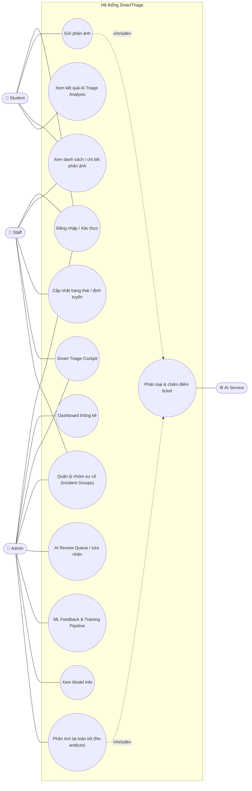
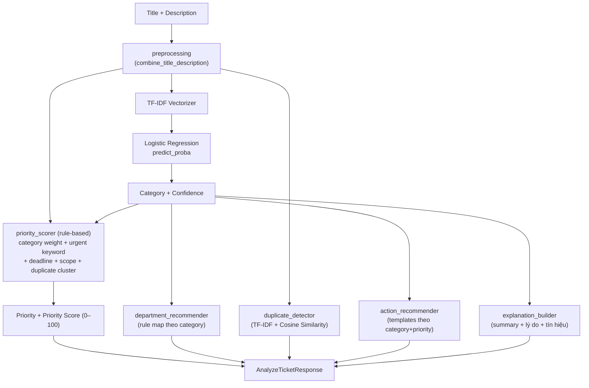
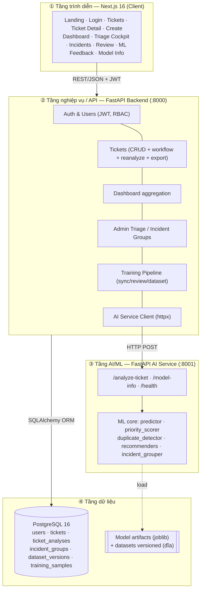
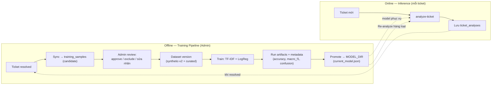
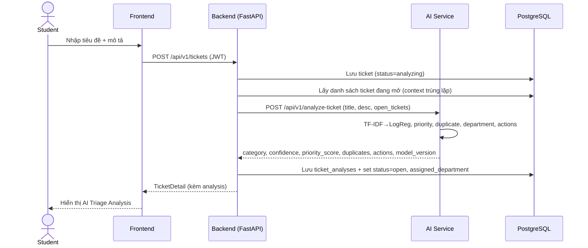
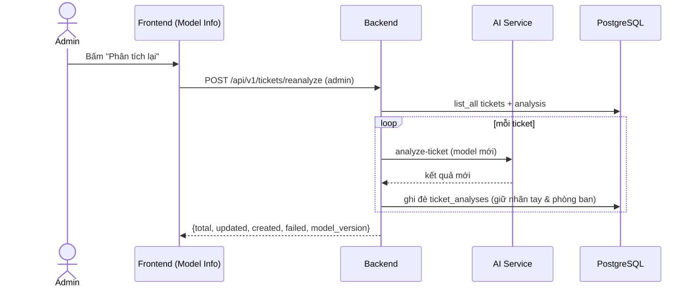
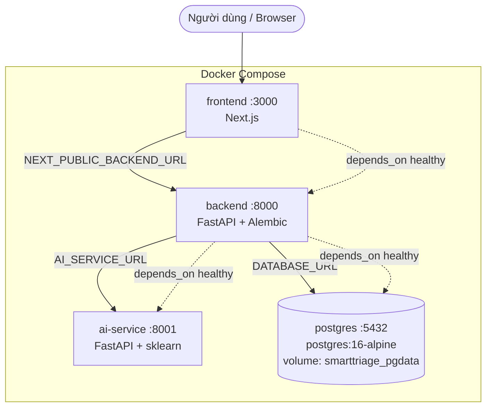

# SmartTriage — Tổng hợp kiến trúc cho báo cáo (4 chương)

> Bộ tư liệu kiến trúc tổng hợp **đúng theo codebase thực tế** (đối chiếu `docker-compose.yml`,
> `requirements.txt`, `package.json`, router API, module ML và models DB). Các sơ đồ viết bằng
> **Mermaid** — render trực tiếp trên Notion/Typora/VS Code/GitLab hoặc export ảnh chèn Word.

## Bố cục 4 chương

| Chương | Nội dung | Sơ đồ dùng |
|---|---|---|
| **C1. Tổng quan đề tài** | Bài toán, mục tiêu, phạm vi, tác nhân | Use case tổng quát |
| **C2. Công nghệ & cơ sở lý thuyết** | Tech stack, thuật toán ML | Bảng tech stack, sơ đồ ML |
| **C3. Phân tích & thiết kế hệ thống** | Kiến trúc phân tầng, pipeline, sequence, CSDL | Kiến trúc phân tầng + Pipeline + Sequence + ERD |
| **C4. Triển khai & kết quả** | Container hóa, luồng vận hành, đánh giá | Sơ đồ deployment |

---

# CHƯƠNG 1 — Use case tổng quát

**Tác nhân:** Student (sinh viên), Staff (cán bộ phòng ban), Admin (quản trị/điều phối), và
**AI Service** (tác nhân hệ thống thực hiện phân tích).



> UC2 (gửi phản ánh) và UC12 (re-analyze) đều **«include»** UC13 (AI phân tích) — điểm thể hiện
> giá trị ML cốt lõi, không phải CRUD thuần.

---

# CHƯƠNG 2 — Tech stack & thuật toán ML

## 2.1 Bảng công nghệ (đối chiếu thực tế)

| Tầng | Công nghệ | Phiên bản/ghi chú |
|---|---|---|
| **Frontend** | Next.js (App Router), React, TypeScript, Tailwind CSS, lucide-react | Next 16.2.7 · React 19 · TS 5.7 · Tailwind 3.4 |
| **Backend** | FastAPI, SQLAlchemy 2.x, Alembic, Pydantic v2 / pydantic-settings, python-jose (JWT), passlib+bcrypt, httpx | Auth JWT HS256, token 60' |
| **AI Service** | FastAPI, scikit-learn, pandas, numpy, joblib | TF-IDF + Logistic Regression |
| **CSDL** | PostgreSQL | postgres:16-alpine |
| **Giao tiếp** | REST/JSON; Frontend→Backend (JWT Bearer); Backend→AI (HTTP httpx) | FE **không** gọi trực tiếp AI |
| **Hạ tầng** | Docker, Docker Compose, healthcheck | 4 service |
| **Artifact ML** | joblib (`.joblib`) + metadata JSON | versioned dataset & model |

## 2.2 Thành phần thuật toán ML (module trong `ai-service/app/ml/`)



- **Phân loại:** TF-IDF + Logistic Regression → `category` + `confidence` (max `predict_proba`);
  có fallback rule-based bằng từ khóa khi thiếu artifact.
- **Phát hiện trùng:** TF-IDF + Cosine Similarity với ticket đang mở (ngưỡng ~0.70 trùng mạnh /
  0.50–0.69 liên quan).
- **Chấm ưu tiên:** cộng điểm rule-based → map `0–39 low · 40–69 medium · 70–100 high`.
- **Đề xuất phòng ban / hành động:** rule-based theo category (+priority).

---

# CHƯƠNG 3 — Thiết kế hệ thống

## 3.1 Kiến trúc phân tầng



> Nguyên tắc tách tầng: **Frontend chỉ gọi Backend**; Backend giao tiếp AI Service qua HTTP
> (không import chéo code ML); AI Service không truy cập DB nghiệp vụ.

## 3.2 Pipeline ML — Offline (huấn luyện) & Online (suy luận)



> Vòng phản hồi ML khép kín: ticket đã xử lý → dữ liệu huấn luyện → model mới → promote →
> (re-analyze) cập nhật lại ticket cũ.

## 3.3 Sequence — Gửi phản ánh + AI phân tích (luồng lõi)



## 3.4 Sequence — Re-analyze sau khi train model mới (Admin)



## 3.5 ERD — Lược đồ CSDL

```mermaid
erDiagram
    USERS ||--o{ TICKETS : "tạo"
    TICKETS ||--o| TICKET_ANALYSES : "có 1"
    INCIDENT_GROUPS ||--o{ INCIDENT_GROUP_TICKETS : "gồm"
    TICKETS ||--o{ INCIDENT_GROUP_TICKETS : "thuộc"
    TICKETS ||--o{ TRAINING_SAMPLES : "sinh ra"
    DATASET_VERSIONS ||--o{ TRAINING_SAMPLES : "gom"

    USERS { uuid id; string full_name; string email; string role; string department }
    TICKETS { uuid id; string title; text description; enum status; uuid created_by_id; string assigned_department; string manual_category; string manual_priority }
    TICKET_ANALYSES { uuid id; uuid ticket_id; string predicted_category; float category_confidence; string priority; int priority_score; string suggested_department; json duplicate_candidates; json suggested_actions; json analysis_metadata; string model_version }
    INCIDENT_GROUPS { uuid id; string title; enum status }
    DATASET_VERSIONS { uuid id; string version; enum status }
    TRAINING_SAMPLES { uuid id; uuid source_ticket_id; string category; string priority; string label_source; enum review_status }
```

---

# CHƯƠNG 4 — Triển khai (Deployment)



- Mỗi service có **healthcheck**; backend khởi động chạy `alembic upgrade head` rồi `uvicorn`.
- Khởi chạy toàn hệ thống: `docker compose up --build` → FE `:3000`,
  BE `:8000/api/v1/health`, AI `:8001/api/v1/health`.
- Biến môi trường chính: `DATABASE_URL`, `AI_SERVICE_URL`, `JWT_SECRET_KEY`, `MODEL_DIR`, `DATASET_PATH`.
