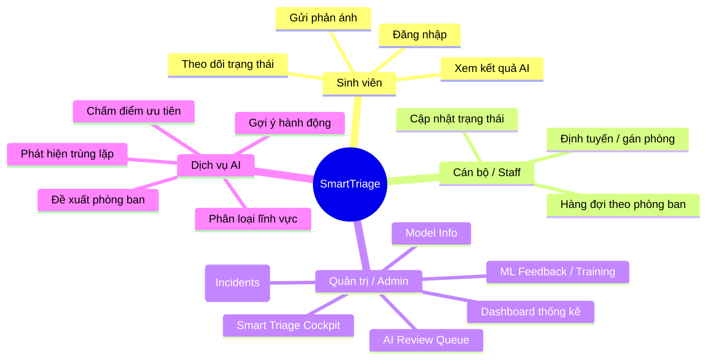
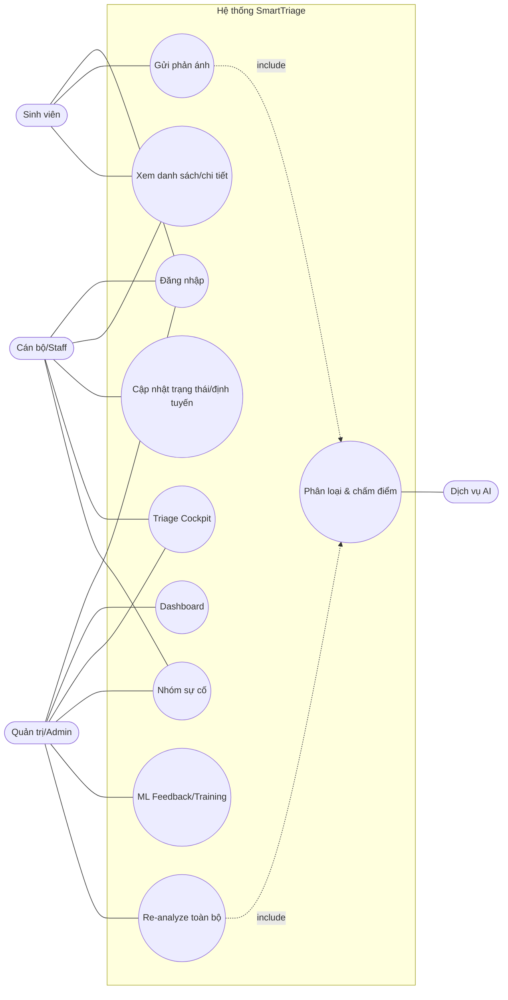
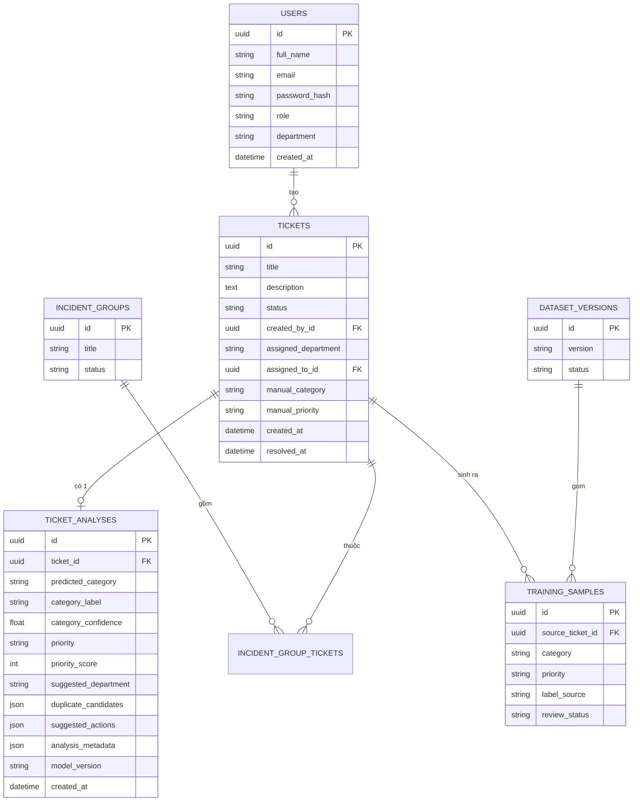
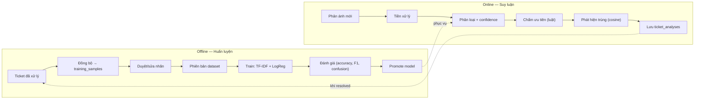
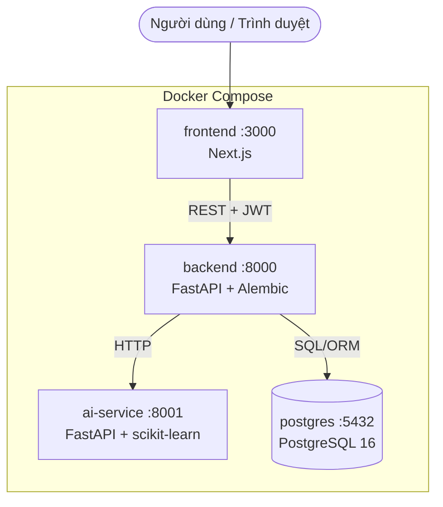

# BÁO CÁO ĐỒ ÁN — HỆ THỐNG SMARTTRIAGE

> **SmartTriage — Hệ thống phân loại và ưu tiên phản ánh sinh viên bằng Machine Learning.**
>
> Tài liệu này bám sát cấu trúc báo cáo 4 chương. Nội dung được điều chỉnh theo đúng
> nghiệp vụ thực tế của dự án (tiếp nhận – phân loại – chấm ưu tiên – định tuyến phản ánh
> sinh viên). Các vị trí cần **số liệu đo thực nghiệm** hoặc **ảnh chụp màn hình** được đánh dấu
> bằng `〔…〕` để người viết điền khi hoàn thiện.

---

## MỤC LỤC

- [DANH MỤC CÁC KÝ HIỆU, CÁC CHỮ VIẾT TẮT](#danh-mục-các-ký-hiệu-các-chữ-viết-tắt)
- [DANH MỤC CÁC BẢNG](#danh-mục-các-bảng)
- [DANH MỤC HÌNH ẢNH](#danh-mục-hình-ảnh)
- [CHƯƠNG 1. TỔNG QUAN](#chương-1-tổng-quan)
- [CHƯƠNG 2. NỘI DUNG VÀ PHƯƠNG PHÁP NGHIÊN CỨU](#chương-2-nội-dung-và-phương-pháp-nghiên-cứu)
- [CHƯƠNG 3. KẾT QUẢ VÀ SẢN PHẨM ĐẠT ĐƯỢC](#chương-3-kết-quả-và-sản-phẩm-đạt-được)
- [CHƯƠNG 4. KẾT LUẬN](#chương-4-kết-luận)
- [TÀI LIỆU THAM KHẢO](#tài-liệu-tham-khảo)

---

## DANH MỤC CÁC KÝ HIỆU, CÁC CHỮ VIẾT TẮT

| Viết tắt | Tiếng Anh | Diễn giải |
|---|---|---|
| AI | Artificial Intelligence | Trí tuệ nhân tạo |
| ML | Machine Learning | Học máy |
| EDM | Educational Data Mining | Khai phá dữ liệu giáo dục |
| TF-IDF | Term Frequency – Inverse Document Frequency | Trọng số tần suất từ – nghịch tần suất văn bản |
| LR / LogReg | Logistic Regression | Hồi quy logistic (mô hình phân loại) |
| LinearSVC | Linear Support Vector Classifier | Máy vector hỗ trợ tuyến tính (phương án phụ) |
| NLP | Natural Language Processing | Xử lý ngôn ngữ tự nhiên |
| LMS | Learning Management System | Hệ thống quản lý học tập |
| API | Application Programming Interface | Giao diện lập trình ứng dụng |
| REST | Representational State Transfer | Kiến trúc dịch vụ web theo tài nguyên |
| JWT | JSON Web Token | Cơ chế token xác thực |
| RBAC | Role-Based Access Control | Phân quyền theo vai trò |
| ORM | Object-Relational Mapping | Ánh xạ đối tượng – quan hệ |
| ERD | Entity Relationship Diagram | Lược đồ thực thể – quan hệ |
| CRUD | Create – Read – Update – Delete | Bốn thao tác dữ liệu cơ bản |
| UI / UX | User Interface / User Experience | Giao diện / Trải nghiệm người dùng |
| SPA | Single Page Application | Ứng dụng web một trang |
| JSON | JavaScript Object Notation | Định dạng dữ liệu trao đổi |
| HTTP | HyperText Transfer Protocol | Giao thức truyền siêu văn bản |
| CSV | Comma-Separated Values | Định dạng dữ liệu phân tách bằng dấu phẩy |
| CI/CD | Continuous Integration / Continuous Delivery | Tích hợp / phân phối liên tục |
| SQL | Structured Query Language | Ngôn ngữ truy vấn dữ liệu |

---

## DANH MỤC CÁC BẢNG

- Bảng 2.1. Danh sách yêu cầu chức năng theo vai trò
- Bảng 2.2. Yêu cầu phi chức năng
- Bảng 2.3. Mô tả bảng `users`
- Bảng 2.4. Mô tả bảng `tickets`
- Bảng 2.5. Mô tả bảng `ticket_analyses`
- Bảng 2.6. Mô tả bảng `incident_groups` và `incident_group_tickets`
- Bảng 2.7. Mô tả bảng `dataset_versions` và `training_samples`
- Bảng 3.1. Thống kê kết quả phát triển (dòng code, số module, số API)
- Bảng 3.2. Danh sách chức năng hoàn thành
- Bảng 3.3. Cấu hình siêu tham số mô hình phân loại
- Bảng 3.4. Kết quả đánh giá mô hình (Accuracy, Precision, Recall, F1)
- Bảng 3.5. So sánh quy trình thủ công và SmartTriage

---

## DANH MỤC HÌNH ẢNH

- Hình 2.1. Sơ đồ mindmap chức năng hệ thống
- Hình 2.2. Sơ đồ Use Case tổng quát
- Hình 2.3. Lược đồ cơ sở dữ liệu quan hệ (ERD)
- Hình 3.1. Kiến trúc triển khai tổng thể (Docker Compose)
- Hình 3.2. Pipeline ML offline & online
- Hình 3.3. Trang đăng nhập
- Hình 3.4. Dashboard tổng quan
- Hình 3.5. Trang gửi phản ánh
- Hình 3.6. Trang chi tiết phản ánh + AI Triage Analysis
- Hình 3.7. Smart Triage Cockpit
- Hình 3.8. Trang quản trị / Model Info & Training Pipeline
- Hình 3.9. Ma trận nhầm lẫn (Confusion Matrix)
- Hình 3.10. Phân tích trọng số đặc trưng TF-IDF theo nhóm

---

# CHƯƠNG 1. TỔNG QUAN

## 1.1. Tính Cấp Thiết của Đề Tài

Trong môi trường giáo dục đại học, sinh viên thường xuyên gửi phản ánh, kiến nghị, sự cố
(mất Wi-Fi, lỗi đăng nhập hệ thống thi, thiết bị phòng học hỏng, vướng mắc học phí, hồ sơ…)
qua nhiều kênh rời rạc: email, biểu mẫu giấy, nhóm chat, hộp thư góp ý. Cách tiếp nhận thủ công
dẫn đến ba vấn đề lớn:

1. **Phân loại sai và chậm:** cán bộ phải đọc thủ công từng phản ánh để xác định thuộc lĩnh vực
   nào và chuyển cho phòng ban phù hợp, dễ nhầm và tốn thời gian.
2. **Không xác định được mức ưu tiên:** các phản ánh khẩn cấp (ví dụ lỗi đăng nhập ngay trước giờ
   thi) bị xử lý lẫn với các phản ánh thông thường.
3. **Trùng lặp và bỏ sót sự cố diện rộng:** nhiều sinh viên phản ánh cùng một sự cố nhưng hệ thống
   không phát hiện để gom nhóm, gây xử lý lặp và bỏ lỡ sự cố nghiêm trọng.

Việc ứng dụng Machine Learning để **tự động phân loại, chấm điểm ưu tiên, phát hiện phản ánh
tương tự và đề xuất phòng ban xử lý** là cấp thiết nhằm rút ngắn thời gian phản hồi, tăng tính
minh bạch và nâng cao chất lượng phục vụ sinh viên.

## 1.2. Mục Tiêu Nghiên Cứu

Xây dựng **SmartTriage** — một hệ thống tiếp nhận và điều phối phản ánh sinh viên có tích hợp AI,
với các mục tiêu cụ thể:

- Tự động **phân loại** nội dung phản ánh vào nhóm lĩnh vực kèm độ tin cậy (confidence).
- Tự động **chấm điểm ưu tiên** (0–100) và quy về 3 mức `Thấp / Trung bình / Cao`, có giải thích.
- **Phát hiện phản ánh tương tự / trùng lặp** và gợi ý **nhóm sự cố** cùng chủ đề.
- **Đề xuất phòng ban xử lý** và **gợi ý các bước hành động** ban đầu.
- Cung cấp **bảng điều khiển điều phối (Smart Triage Cockpit)** giúp cán bộ biết nên xử lý gì trước.
- Thiết lập **vòng phản hồi học máy (ML feedback loop)**: dữ liệu phản ánh đã xử lý được dùng để
  huấn luyện lại và nâng cấp mô hình.

## 1.3. Đối Tượng và Phạm Vi Nghiên Cứu

### 1.3.1. Đối tượng nghiên cứu

- Quy trình tiếp nhận – phân loại – ưu tiên – định tuyến – xử lý phản ánh của sinh viên.
- Các kỹ thuật ML cho phân loại văn bản tiếng Việt: TF-IDF, Logistic Regression, Cosine Similarity.
- Kiến trúc phần mềm tách dịch vụ (frontend – backend nghiệp vụ – dịch vụ AI – cơ sở dữ liệu).

### 1.3.2. Phạm vi nghiên cứu

- **Về nghiệp vụ:** phản ánh dạng văn bản (tiêu đề + mô tả) của sinh viên; ba vai trò người dùng:
  *sinh viên*, *cán bộ phòng ban (staff)*, *quản trị/điều phối (admin)*.
- **Về ML:** phân loại đa nhãn lĩnh vực, chấm ưu tiên dựa trên luật, phát hiện trùng lặp bằng
  độ tương đồng cosine; chưa bao gồm xử lý giọng nói/hình ảnh.
- **Về kỹ thuật:** triển khai bằng container Docker trên môi trường máy chủ đơn; chưa mở rộng
  sang hạ tầng phân tán quy mô lớn.

## 1.4. Ý Nghĩa Thực Tiễn

### 1.4.1. Đối với nhà trường

Chuẩn hóa kênh tiếp nhận phản ánh, có số liệu thống kê theo lĩnh vực/ưu tiên/trạng thái, hỗ trợ
ra quyết định và minh bạch hóa quá trình xử lý.

### 1.4.2. Đối với phòng ban xử lý

Nhận đúng phản ánh thuộc thẩm quyền, có sẵn gợi ý hành động và mức ưu tiên, giảm thời gian phân loại
thủ công và tránh bỏ sót ca khẩn cấp.

### 1.4.3. Đối với cán bộ điều phối / quản trị

Có **Smart Triage Cockpit** tổng hợp hàng đợi ưu tiên, ca cần rà soát (confidence thấp) và các
nhóm sự cố diện rộng, giúp phân bổ nguồn lực hợp lý.

### 1.4.4. Đối với sinh viên

Phản ánh được tiếp nhận, phân loại và phản hồi nhanh, minh bạch trạng thái xử lý, tăng sự hài lòng
và niềm tin vào nhà trường.

### 1.4.5. Đóng góp khoa học

- Một quy trình **triage phản ánh giáo dục** kết hợp phân loại văn bản + chấm ưu tiên theo luật +
  phát hiện sự cố diện rộng.
- Mô hình **vòng phản hồi dữ liệu khép kín** (resolved tickets → curate → retrain → promote → re-analyze)
  có quản lý phiên bản dataset và model.

## 1.5. Tổng Quan Công Nghệ Liên Quan

### 1.5.1. Các hệ thống quản lý học tập (LMS) và help-desk hiện có

Các nền tảng LMS (Moodle…) và help-desk (Zendesk, Jira Service Management…) hỗ trợ tạo
ticket/ phản ánh nhưng thường: (i) phân loại và định tuyến **thủ công** hoặc theo luật cứng;
(ii) không chấm điểm ưu tiên có giải thích phù hợp ngữ cảnh giáo dục; (iii) khó tùy biến cho
dữ liệu tiếng Việt và quy trình của trường. SmartTriage hướng tới một giải pháp **chuyên biệt,
giải thích được và có vòng phản hồi học máy**.

### 1.5.2. Machine Learning trong giáo dục (Educational Data Mining)

EDM ứng dụng ML để phân tích dữ liệu giáo dục. Với bài toán phản ánh sinh viên, hướng tiếp cận
phù hợp là **phân loại văn bản** (text classification) và **truy hồi tương đồng** (similarity
retrieval). TF-IDF + Logistic Regression là lựa chọn cân bằng giữa độ chính xác, tốc độ suy luận,
khả năng giải thích và yêu cầu dữ liệu — phù hợp quy mô dữ liệu của một trường đại học.

### 1.5.3. Kiến trúc công nghệ

| Tầng | Công nghệ | Vai trò |
|---|---|---|
| Frontend | Next.js (App Router), React, TypeScript, Tailwind CSS | Giao diện sinh viên & quản trị (SPA) |
| Backend nghiệp vụ | FastAPI, SQLAlchemy, Alembic, Pydantic v2, JWT | Auth, ticket workflow, dashboard, tích hợp AI |
| Dịch vụ AI | FastAPI, scikit-learn, pandas, numpy, joblib | Phân loại, chấm ưu tiên, phát hiện trùng, đề xuất |
| Cơ sở dữ liệu | PostgreSQL | Lưu người dùng, ticket, kết quả phân tích, dataset |
| Hạ tầng | Docker, Docker Compose | Đóng gói & triển khai 4 dịch vụ |

Nguyên tắc kiến trúc: **Frontend chỉ gọi Backend; Backend giao tiếp Dịch vụ AI qua HTTP**
(không import chéo code ML); Dịch vụ AI không truy cập trực tiếp cơ sở dữ liệu nghiệp vụ.

---

# CHƯƠNG 2. NỘI DUNG VÀ PHƯƠNG PHÁP NGHIÊN CỨU

## 2.1. Nội Dung Nghiên Cứu – Phân Tích Yêu Cầu Hệ Thống

### 2.1.1. Sơ Đồ Mindmap Chức Năng Hệ Thống

*Hình 2.1. Sơ đồ mindmap chức năng hệ thống*

### 2.1.2. Yêu Cầu Chức Năng

*Bảng 2.1. Danh sách yêu cầu chức năng theo vai trò*

| Mã | Vai trò | Yêu cầu chức năng |
|---|---|---|
| FR-01 | Tất cả | Đăng nhập/đăng xuất bằng tài khoản, xác thực JWT |
| FR-02 | Sinh viên | Gửi phản ánh (tiêu đề + mô tả) |
| FR-03 | Sinh viên | Xem danh sách phản ánh của bản thân và trạng thái |
| FR-04 | Sinh viên | Xem kết quả AI Triage Analysis của phản ánh |
| FR-05 | Hệ thống/AI | Tự động phân loại lĩnh vực + độ tin cậy khi tạo phản ánh |
| FR-06 | Hệ thống/AI | Chấm điểm ưu tiên 0–100 và quy mức Thấp/Trung bình/Cao |
| FR-07 | Hệ thống/AI | Phát hiện phản ánh tương tự (cosine similarity) |
| FR-08 | Hệ thống/AI | Đề xuất phòng ban + gợi ý hành động |
| FR-09 | Staff | Xem hàng đợi theo phòng ban, cập nhật trạng thái |
| FR-10 | Staff/Admin | Gán/đổi phòng phụ trách, ghi đè nhãn/ưu tiên thủ công |
| FR-11 | Admin | Dashboard thống kê theo lĩnh vực/ưu tiên/trạng thái |
| FR-12 | Admin | Smart Triage Cockpit: critical queue, low-confidence, incident |
| FR-13 | Admin | Gợi ý và quản lý nhóm sự cố (incident grouping) |
| FR-14 | Admin | Đồng bộ ticket đã xử lý vào tập huấn luyện, duyệt mẫu |
| FR-15 | Admin | Tạo phiên bản dataset, huấn luyện & promote model |
| FR-16 | Admin | Phân tích lại toàn bộ phản ánh (re-analyze) sau khi đổi model |
| FR-17 | Admin | Xem Model Info (phiên bản, độ chính xác, thuật toán) |

### 2.1.3. Yêu Cầu Phi Chức Năng

*Bảng 2.2. Yêu cầu phi chức năng*

| Mã | Loại | Mô tả |
|---|---|---|
| NFR-01 | Hiệu năng | Thời gian phân tích một phản ánh ≤ 〔điền〕 giây |
| NFR-02 | Khả dụng | Mỗi dịch vụ có healthcheck; backend tự chạy migration khi khởi động |
| NFR-03 | Bảo mật | Mật khẩu băm (bcrypt), xác thực JWT, phân quyền RBAC |
| NFR-04 | Khả mở rộng | Dịch vụ AI tách riêng, scale độc lập với backend |
| NFR-05 | Khả chịu lỗi | AI lỗi vẫn tạo được ticket (fallback rule-based), không chặn nghiệp vụ |
| NFR-06 | Khả bảo trì | Kiến trúc tách tầng, code chia module, có test tự động |
| NFR-07 | Khả dùng | Giao diện responsive, có trạng thái loading/empty/error |

### 2.1.4. Sơ Đồ Use Case

*Hình 2.2. Sơ đồ Use Case tổng quát*

### 2.1.5. Lược Đồ Cơ Sở Dữ Liệu Quan Hệ (ERD)

*Hình 2.3. Lược đồ cơ sở dữ liệu quan hệ (ERD)*

### 2.1.6. Bảng Mô Tả Chi Tiết Cơ Sở Dữ Liệu

*Bảng 2.3. Mô tả bảng `users`*

| Trường | Kiểu | Ràng buộc | Ý nghĩa |
|---|---|---|---|
| id | UUID | PK | Khóa chính |
| full_name | string | NOT NULL | Họ tên |
| email | string | UNIQUE | Email đăng nhập |
| password_hash | string | NOT NULL | Mật khẩu đã băm (bcrypt) |
| role | enum | student/staff/admin | Vai trò |
| department | string | NULL | Phòng ban (với staff) |
| created_at | datetime | default now | Thời điểm tạo |

*Bảng 2.4. Mô tả bảng `tickets`*

| Trường | Kiểu | Ràng buộc | Ý nghĩa |
|---|---|---|---|
| id | UUID | PK | Khóa chính |
| title | string | NOT NULL | Tiêu đề phản ánh |
| description | text | | Nội dung chi tiết |
| status | enum | new/analyzing/open/in_progress/resolved/rejected | Trạng thái xử lý |
| created_by_id | UUID | FK→users | Người gửi |
| assigned_department | string | NULL | Phòng phụ trách (định tuyến thực tế) |
| assigned_to_id | UUID | FK→users, NULL | Cán bộ phụ trách |
| manual_category | string | NULL | Nhãn lĩnh vực do người dùng ghi đè |
| manual_priority | string | NULL | Mức ưu tiên do người dùng ghi đè |
| created_at / updated_at / resolved_at | datetime | | Mốc thời gian |

*Bảng 2.5. Mô tả bảng `ticket_analyses`*

| Trường | Kiểu | Ý nghĩa |
|---|---|---|
| id | UUID | Khóa chính |
| ticket_id | UUID (FK, UNIQUE) | Phản ánh tương ứng (1–1) |
| predicted_category | string | Nhãn lĩnh vực do AI dự đoán |
| category_label | string | Nhãn hiển thị (tiếng Việt) |
| category_confidence | float | Độ tin cậy phân loại (0–1) |
| priority | string | Mức ưu tiên (low/medium/high) |
| priority_score | int | Điểm ưu tiên (0–100) |
| suggested_department | string | Phòng ban đề xuất |
| duplicate_candidates | json | Danh sách phản ánh tương tự + độ tương đồng |
| suggested_actions | json | Danh sách hành động gợi ý |
| analysis_metadata | json | Giải thích (explanation) + breakdown điểm ưu tiên |
| model_version | string | Phiên bản model sinh ra kết quả |
| created_at | datetime | Thời điểm phân tích |

*Bảng 2.6. Mô tả bảng `incident_groups` và `incident_group_tickets`*

| Bảng | Trường | Ý nghĩa |
|---|---|---|
| incident_groups | id, title, status | Nhóm sự cố diện rộng do hệ thống/quản trị gom |
| incident_group_tickets | group_id (FK), ticket_id (FK) | Bảng nối nhiều–nhiều giữa nhóm và phản ánh |

*Bảng 2.7. Mô tả bảng `dataset_versions` và `training_samples`*

| Bảng | Trường | Ý nghĩa |
|---|---|---|
| dataset_versions | id, version, status | Phiên bản tập huấn luyện (đối chiếu model) |
| training_samples | id, source_ticket_id, category, priority, label_source, review_status | Mẫu huấn luyện sinh từ ticket đã xử lý, có trạng thái duyệt |

## 2.2. Phương Pháp Nghiên Cứu

### 2.2.1. Phương Pháp Nghiên Cứu Tài Liệu

Khảo sát tài liệu về xử lý ngôn ngữ tự nhiên (TF-IDF, Logistic Regression), khai phá dữ liệu giáo dục,
quy trình help-desk/ticketing và kiến trúc microservice; làm cơ sở lựa chọn thuật toán và kiến trúc.

### 2.2.2. Phương Pháp Phân Tích Yêu Cầu

Sử dụng mô hình hóa **Use Case**, **ERD**, sơ đồ chức năng để xác định yêu cầu chức năng/phi chức năng
và thiết kế cơ sở dữ liệu trước khi hiện thực.

### 2.2.3. Phương Pháp Phát Triển Phần Mềm

Phát triển lặp – tăng dần (iterative) theo module; kiến trúc **tách dịch vụ** (frontend/backend/AI/DB);
quản lý phiên bản bằng Git; đóng gói bằng Docker Compose để đảm bảo môi trường nhất quán.

### 2.2.4. Phương Pháp Xây Dựng Mô Hình AI

Quy trình ML gồm hai pha:

*Hình 3.2. Pipeline ML offline & online*

- **Phân loại lĩnh vực:** TF-IDF Vectorizer + Logistic Regression; đầu ra là nhãn + độ tin cậy
  (xác suất lớn nhất từ `predict_proba`). Có cơ chế dự phòng theo từ khóa khi thiếu artifact.
- **Chấm ưu tiên:** cộng điểm theo luật (trọng số lĩnh vực + từ khóa khẩn cấp + tín hiệu hạn chót +
  phạm vi ảnh hưởng + cụm trùng lặp), quy về `0–39 Thấp · 40–69 Trung bình · 70–100 Cao`.
- **Phát hiện trùng:** TF-IDF + Cosine Similarity với các phản ánh đang mở (ngưỡng tham khảo
  ~0.70 trùng mạnh, 0.50–0.69 liên quan).
- **Đề xuất phòng ban / hành động:** ánh xạ theo luật từ lĩnh vực (+ mức ưu tiên).

### 2.2.5. Phương Pháp Kiểm Thử

- **Kiểm thử đơn vị (unit test):** cho backend (auth, ticket workflow, dashboard, re-analyze) và
  dịch vụ AI (tiền xử lý, phân loại, chấm ưu tiên, phát hiện trùng, endpoint analyze).
- **Kiểm thử tích hợp:** luồng tạo ticket end-to-end gọi qua dịch vụ AI và lưu kết quả.
- **Kiểm thử mô hình:** đánh giá trên tập kiểm tra (holdout) với Accuracy, Precision, Recall, F1,
  confusion matrix.
- **Kiểm thử giao diện:** kiểm tra build/lint, render các route chính, trạng thái loading/empty/error.

---

# CHƯƠNG 3. KẾT QUẢ VÀ SẢN PHẨM ĐẠT ĐƯỢC

## 3.1. Kết Quả Xây Dựng Hệ Thống

### 3.1.1. Kiến Trúc Triển Khai Tổng Thể

*Hình 3.1. Kiến trúc triển khai tổng thể (Docker Compose)*

Toàn hệ thống khởi chạy bằng `docker compose up --build`; backend tự chạy `alembic upgrade head`
trước khi phục vụ; mỗi dịch vụ có healthcheck riêng.

### 3.1.2. Thống Kê Kết Quả Phát Triển

*Bảng 3.1. Thống kê kết quả phát triển*

| Hạng mục | Số lượng |
|---|---|
| Dịch vụ (service) | 4 (frontend, backend, ai-service, postgres) |
| Bảng cơ sở dữ liệu | 〔điền〕 |
| Nhóm API backend | auth, users, tickets, dashboard, admin-triage, incident-groups, training-pipeline, ai |
| Module ML | preprocessing, predictor, priority_scorer, duplicate_detector, department/action recommender, explanation_builder, incident_grouper, training_pipeline |
| Số dòng code (LOC) | 〔điền〕 |
| Số ca kiểm thử tự động | 〔điền〕 |

### 3.1.3. Các Chức Năng Hoàn Thành

*Bảng 3.2. Danh sách chức năng hoàn thành*

| Nhóm | Chức năng | Trạng thái |
|---|---|---|
| Xác thực | Đăng nhập JWT, phân quyền RBAC | ✅ |
| Phản ánh | Gửi, danh sách (phân trang), chi tiết | ✅ |
| AI | Phân loại, confidence, chấm ưu tiên, breakdown, trùng lặp, đề xuất phòng/hành động, giải thích | ✅ |
| Điều phối | Dashboard, Smart Triage Cockpit, nhóm sự cố | ✅ |
| ML Ops | Đồng bộ dữ liệu, duyệt mẫu, phiên bản dataset, Model Info, re-analyze | ✅ |
| Vận hành | Đóng gói Docker, healthcheck, migration tự động | ✅ |

## 3.2. Demo Giao Diện Hệ Thống

### 3.2.1. Trang Đăng Nhập
〔Ảnh chụp màn hình — Hình 3.3〕 Giao diện đăng nhập tách đôi (panel giới thiệu + form), hỗ trợ
tài khoản demo theo vai trò.

### 3.2.2. Dashboard Tổng Quan (Admin / Cán bộ)
〔Ảnh chụp màn hình — Hình 3.4〕 Thống kê tổng phản ánh, theo lĩnh vực, ưu tiên, trạng thái; biểu đồ
thanh có hiệu ứng nạp dữ liệu.

### 3.2.3. Trang Gửi Phản Ánh
〔Ảnh chụp màn hình — Hình 3.5〕 Form nhập tiêu đề + mô tả; có hướng dẫn để AI phân tích chính xác hơn.

### 3.2.4. Trang Chi Tiết Phản Ánh + AI Triage Analysis
〔Ảnh chụp màn hình — Hình 3.6〕 Hiển thị nhãn lĩnh vực, độ tin cậy, điểm ưu tiên (vòng đo),
breakdown điểm, phản ánh tương tự, phòng ban đề xuất, gợi ý hành động và phiên bản model.

### 3.2.5. Smart Triage Cockpit (Điều phối)
〔Ảnh chụp màn hình — Hình 3.7〕 Critical Queue, Low Confidence Cases, AI Routing Recommendations,
Possible Incident Groups.

### 3.2.6. Trang Quản Trị (Model Info & Training Pipeline)
〔Ảnh chụp màn hình — Hình 3.8〕 Thông tin model đang phục vụ, quản lý dataset, đồng bộ/duyệt mẫu
huấn luyện, nút phân tích lại toàn bộ.

## 3.3. Kết Quả Mô Hình AI

### 3.3.1. Tập Dữ Liệu Huấn Luyện

- **Nguồn:** dữ liệu mô phỏng (synthetic) kết hợp dữ liệu curate từ phản ánh đã xử lý.
- **Nhãn lĩnh vực:** `account_system, network, classroom_device, facility, schedule_exam,
  tuition_payment, document_profile, learning_platform, feedback, other`.
- **Phiên bản dataset:** quản lý theo `dataset_versions` (ví dụ `synthetic-v2`).
- **Quy mô:** 〔điền số mẫu / phân bố theo nhãn từ `model_metadata.json`〕.

### 3.3.2. Cấu Hình Mô Hình

*Bảng 3.3. Cấu hình siêu tham số mô hình phân loại*

| Thành phần | Cấu hình |
|---|---|
| Tiền xử lý | Ghép tiêu đề + mô tả, chuẩn hóa văn bản |
| Vector hóa | TF-IDF Vectorizer 〔ngram_range, max_features… điền〕 |
| Bộ phân loại | Logistic Regression 〔C, solver, max_iter… điền〕 |
| Phương án phụ | LinearSVC (nếu dùng) |
| Lưu trữ artifact | joblib (`category_classifier.joblib`, `tfidf_vectorizer.joblib`, `label_encoder.joblib`) + `model_metadata.json` |

### 3.3.3. Kết Quả Đánh Giá Mô Hình

*Bảng 3.4. Kết quả đánh giá mô hình (trên tập kiểm tra)*

| Chỉ số | Giá trị |
|---|---|
| Accuracy | 〔điền〕 |
| Macro Precision | 〔điền〕 |
| Macro Recall | 〔điền〕 |
| Macro F1 | 〔điền〕 |

〔Hình 3.9. Ma trận nhầm lẫn — chèn từ `confusion_matrix.csv`〕

> Lưu ý: các chỉ số trên lấy từ `model_metadata.json` của lần huấn luyện được promote; phạm vi đánh
> giá là holdout nội bộ.

### 3.3.4. Phân Tích Feature Importance (Trọng số đặc trưng)

Với Logistic Regression trên đặc trưng TF-IDF, mỗi nhãn lĩnh vực gắn với một tập **từ/cụm từ có
trọng số dương cao nhất** — phản ánh các tín hiệu quyết định phân loại (ví dụ: nhóm *network* ↔
"wifi, mạng, kết nối"; *account_system* ↔ "đăng nhập, mật khẩu, tài khoản"). 〔Hình 3.10 — chèn bảng
top-k từ khóa theo nhãn〕.

## 3.4. Đánh Giá Hệ Thống

### 3.4.1. Đánh Giá Hiệu Năng

Thời gian suy luận một phản ánh ở mức 〔điền〕 ms; do model tuyến tính nhẹ, đáp ứng tốt nhu cầu
xử lý trực tuyến khi tạo ticket. Dịch vụ AI nạp model từ đĩa và có thể phục vụ độc lập.

### 3.4.2. Đánh Giá Bảo Mật

Mật khẩu băm bcrypt; xác thực JWT; phân quyền theo vai trò (sinh viên/staff/admin); biến bí mật
qua biến môi trường; không commit secret. 〔Bổ sung kết quả rà soát nếu có〕.

### 3.4.3. Đánh Giá Khả Năng Sử Dụng (Usability)

Giao diện responsive, có trạng thái loading/empty/error; điều hướng theo vai trò; kết quả AI được
trình bày trực quan kèm giải thích. 〔Bổ sung khảo sát người dùng nếu có〕.

### 3.4.4. So Sánh Với Hệ Thống Trước Đây

*Bảng 3.5. So sánh quy trình thủ công và SmartTriage*

| Tiêu chí | Quy trình thủ công | SmartTriage |
|---|---|---|
| Phân loại | Con người đọc & gán | Tự động + độ tin cậy |
| Ưu tiên | Cảm tính, không nhất quán | Điểm 0–100 có giải thích |
| Phát hiện trùng | Khó, dễ bỏ sót | Cosine similarity + gợi ý nhóm sự cố |
| Định tuyến | Thủ công | Đề xuất phòng ban tự động |
| Cải tiến | Không có vòng phản hồi | Vòng phản hồi học máy (retrain/promote) |
| Thời gian phản hồi | Chậm | Rút ngắn 〔điền〕 |

---

# CHƯƠNG 4. KẾT LUẬN

## 4.1. Kết Luận

### 4.1.1. Tổng Kết Kết Quả Đạt Được

Đề tài đã xây dựng thành công hệ thống **SmartTriage** với kiến trúc tách dịch vụ, tích hợp ML để
phân loại, chấm ưu tiên, phát hiện trùng lặp và đề xuất xử lý phản ánh sinh viên; kèm bảng điều khiển
điều phối và vòng phản hồi huấn luyện lại model.

### 4.1.2. Đóng Góp Của Đề Tài

- Giải pháp triage phản ánh giáo dục **giải thích được** (có lý do phân loại/ưu tiên).
- Quy trình **MLOps thu nhỏ**: quản lý phiên bản dataset/model, huấn luyện – promote – re-analyze.
- Kiến trúc tham chiếu tách tầng dễ mở rộng và bảo trì.

### 4.1.3. Hạn Chế Của Đề Tài

- Chấm ưu tiên dựa trên luật, chưa học từ dữ liệu nhãn ưu tiên thực tế.
- Dữ liệu huấn luyện còn phụ thuộc dữ liệu mô phỏng; cần thêm dữ liệu thật để tổng quát hóa.
- Chưa hỗ trợ đa kênh (email/chatbot) và đa ngôn ngữ; chưa kiểm thử tải quy mô lớn.

## 4.2. Hướng Phát Triển

### 4.2.1. Ngắn Hạn (6–12 tháng)

- Thu thập & gán nhãn dữ liệu phản ánh thật, tái huấn luyện định kỳ.
- Bổ sung thông báo thời gian thực và tích hợp email.
- Hoàn thiện AI Review Queue để cán bộ sửa nhãn nhanh, nuôi vòng phản hồi.

### 4.2.2. Trung Hạn (1–2 năm)

- Thay/kết hợp mô hình ngôn ngữ (embedding tiếng Việt) cho phân loại & truy hồi tương đồng.
- Học mức ưu tiên từ dữ liệu thay cho luật cứng.
- Bảng phân tích xu hướng sự cố theo thời gian/khu vực.

### 4.2.3. Dài Hạn (2–5 năm)

- Mở rộng đa kênh (chatbot, mobile), đa cơ sở; hạ tầng phân tán, auto-scale.
- Trợ lý AI hội thoại hỗ trợ sinh viên và gợi ý xử lý cho cán bộ.
- Tích hợp toàn diện với hệ sinh thái số của nhà trường.

## 4.3. Lời Kết

SmartTriage minh chứng cho việc ứng dụng ML thực tế vào quy trình phục vụ sinh viên: không chỉ là
một hệ thống quản lý ticket mà là một **trung tâm điều phối phản ánh có hỗ trợ AI**, hướng tới phục vụ
nhanh, minh bạch và cải tiến liên tục.

---

## TÀI LIỆU THAM KHẢO

> Định dạng tham khảo theo kiểu APA; người viết điều chỉnh theo chuẩn trích dẫn của đơn vị (IEEE/APA…).

[1] Pedregosa, F., et al. (2011). Scikit-learn: Machine learning in Python. Journal of Machine Learning Research, 12, 2825–2830.

[2] Manning, C. D., Raghavan, P., & Schütze, H. (2008). Introduction to Information Retrieval. Cambridge University Press.

[3] Sparck Jones, K. (1972). A statistical interpretation of term specificity and its application in retrieval. Journal of Documentation, 28(1), 11–21.

[4] Salton, G., & Buckley, C. (1988). Term-weighting approaches in automatic text retrieval. Information Processing & Management, 24(5), 513–523.

[5] Joachims, T. (1998). Text categorization with support vector machines: Learning with many relevant features. In Proceedings of ECML-98 (pp. 137–142). Springer.

[6] Aggarwal, C. C., & Zhai, C. (2012). A survey of text classification algorithms. In Mining Text Data (pp. 163–222). Springer.

[7] Hosmer, D. W., Lemeshow, S., & Sturdivant, R. X. (2013). Applied Logistic Regression (3rd ed.). John Wiley & Sons.

[8] Lundberg, S. M., & Lee, S. I. (2017). A unified approach to interpreting model predictions. Advances in Neural Information Processing Systems, 30, 4765–4774.

[9] Vu, T., Nguyen, D. Q., Nguyen, D. Q., Dras, M., & Johnson, M. (2018). VnCoreNLP: A Vietnamese natural language processing toolkit. In Proceedings of NAACL-HLT 2018: Demonstrations (pp. 56–60).

[10] Jones, M., Bradley, J., & Sakimura, N. (2015). JSON Web Token (JWT), RFC 7519. Internet Engineering Task Force (IETF). https://datatracker.ietf.org/doc/html/rfc7519

[11] Vercel. (2024). Next.js Documentation. https://nextjs.org/docs

[12] Meta Open Source. (2024). React Documentation. https://react.dev

[13] FastAPI. (2024). FastAPI Documentation. https://fastapi.tiangolo.com

[14] Scikit-learn Developers. (2024). scikit-learn: Machine Learning in Python. https://scikit-learn.org

[15] The PostgreSQL Global Development Group. (2024). PostgreSQL 16 Documentation. https://www.postgresql.org/docs

[16] SQLAlchemy. (2024). SQLAlchemy Documentation. https://docs.sqlalchemy.org

[17] Docker Inc. (2024). Docker Documentation. https://docs.docker.com
