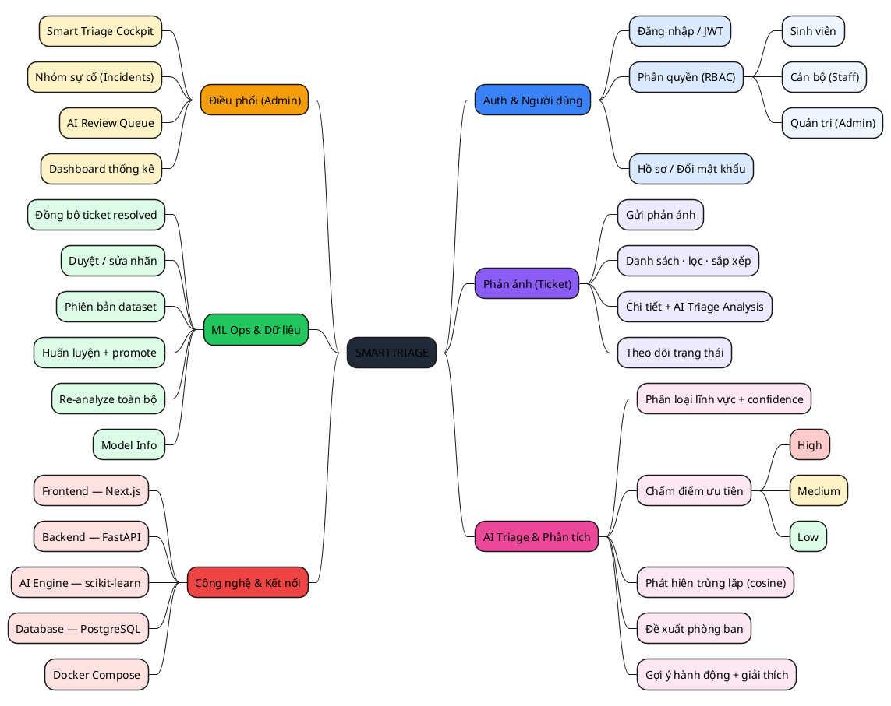
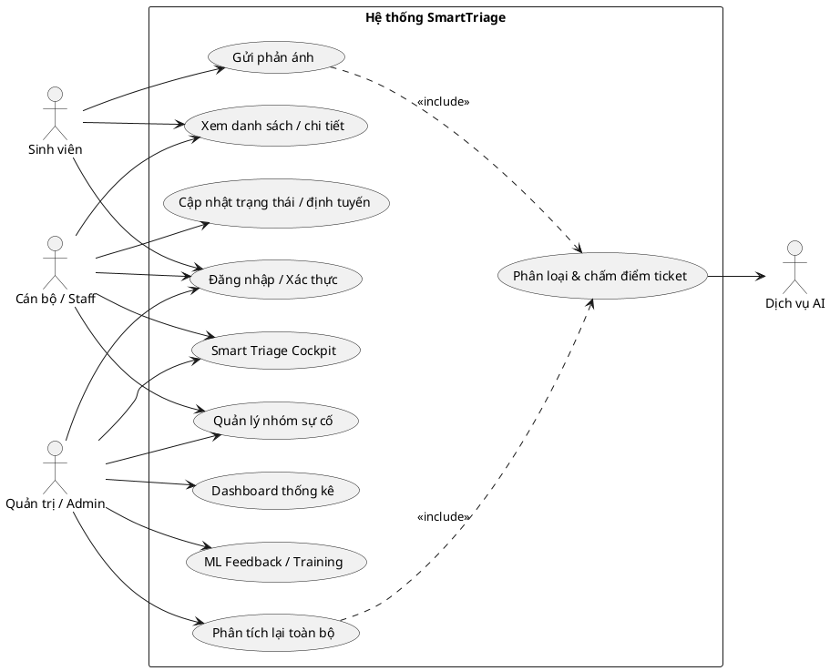
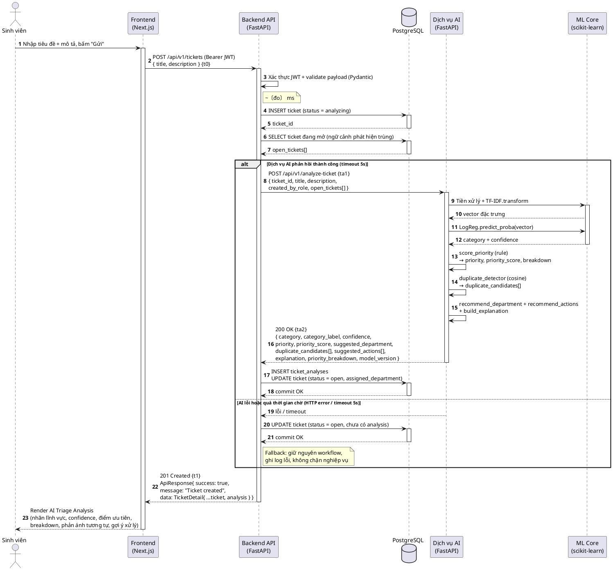
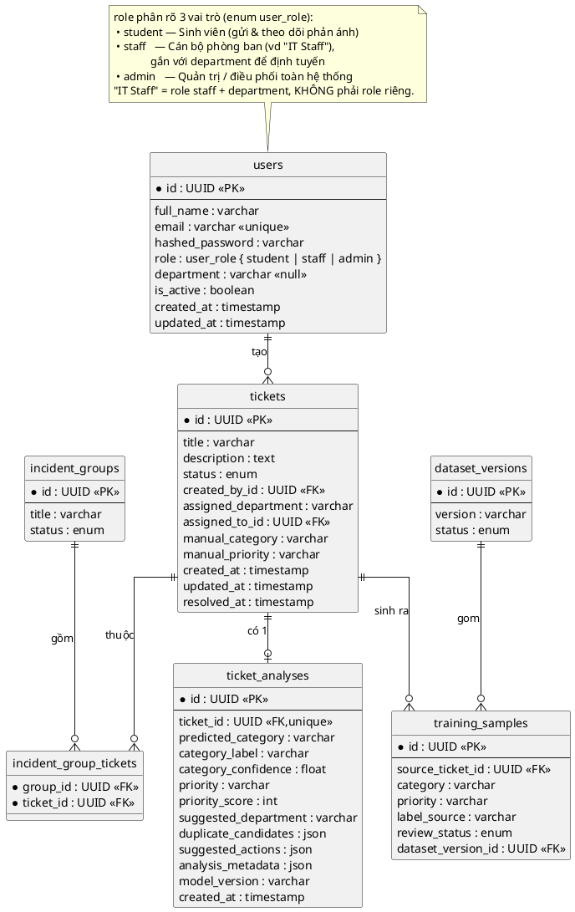
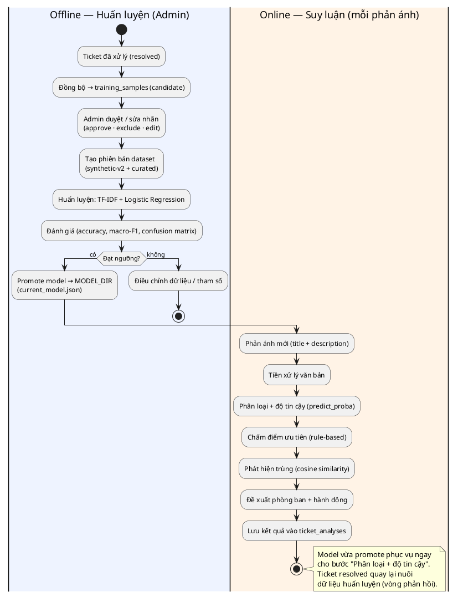
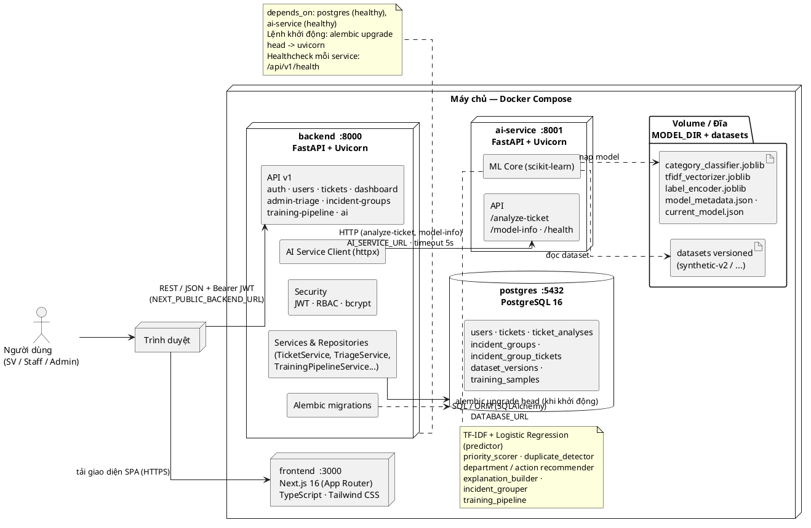
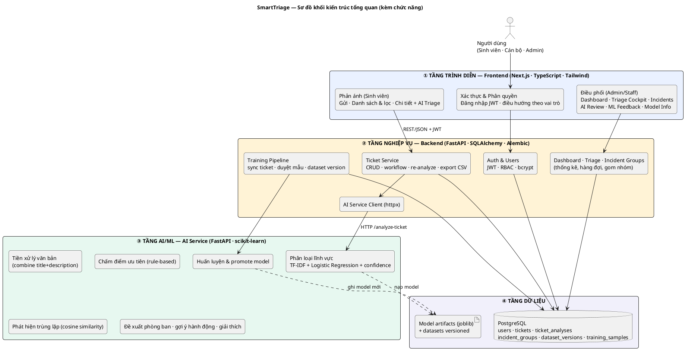

# SmartTriage — Sơ đồ báo cáo (PlantUML)

> Mỗi sơ đồ nằm trong khối ```plantuml. Render bằng: VS Code (extension *PlantUML*),
> IntelliJ (plugin PlantUML), hoặc dán vào https://www.plantuml.com/plantuml.
> Cần Java + Graphviz cho các sơ đồ use case / deployment / ERD; mindmap và sequence
> không cần Graphviz.

---

## Hình 2.1. Sơ đồ Mindmap chức năng hệ thống



---

## Hình 2.2. Sơ đồ Use Case tổng quát



---

## Hình 2.3. Sequence diagram — Gửi phản ánh + AI phân tích



---

## Hình 2.4. Lược đồ cơ sở dữ liệu quan hệ (ERD)



---

## Hình 2.5. Sơ đồ quy trình xây dựng mô hình AI (Pipeline offline & online)



---

## Hình 3.1. Sơ đồ kiến trúc triển khai tổng thể (Docker Compose)



---

## Hình 3.2. Sơ đồ khối kiến trúc tổng quan (kèm chức năng)



> Đọc theo chiều: Người dùng → Frontend → Backend → (AI Service + PostgreSQL). Mỗi khối liệt kê
> chức năng chính của tầng đó. AI Service không truy cập DB nghiệp vụ — chỉ đọc/ghi **model artifacts**
> trên đĩa; Backend là nơi duy nhất nói chuyện với PostgreSQL.

---

### Ghi chú render nhanh

- **VS Code:** cài extension `PlantUML` (jebbs) → mở file → `Alt+D` để preview, hoặc chuột phải → *Export Current Diagram* (PNG/SVG) để chèn Word.
- **Online:** dán từng khối (không gồm dấu ```) vào https://www.plantuml.com/plantuml/uml.
- Nếu thiếu Graphviz, các sơ đồ use case / ERD / deployment có thể báo lỗi `dot`; cài Graphviz rồi đặt biến môi trường `GRAPHVIZ_DOT`.
