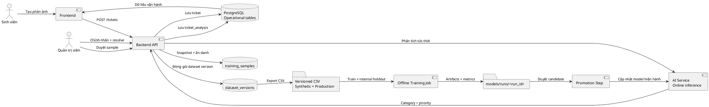

# SmartTriage Offline Training Pipeline

SmartTriage tách dữ liệu vận hành và dữ liệu huấn luyện thành hai luồng độc lập. Ticket thật tiếp tục phục vụ giao diện và inference tức thời; chỉ snapshot đã xử lý, ẩn danh và duyệt nhãn mới được đưa vào dataset huấn luyện.

## 1. Kiến trúc hai luồng



## 2. Quy tắc đưa ticket thật vào training

- Chỉ lấy ticket có trạng thái `resolved`.
- Email, số điện thoại, URL và mã sinh viên được thay bằng placeholder.
- Nhãn staff sửa thủ công được đưa vào trạng thái `approved`.
- Nhãn chỉ do AI dự đoán được đưa vào trạng thái `candidate`, không tự động dùng làm ground truth.
- Sample đã thuộc một dataset version trở thành immutable.
- Nội dung trùng được loại bằng SHA-256 trên title + description đã chuẩn hóa.

## 3. Bảng dữ liệu offline

### `training_samples`

- Snapshot title và description đã ẩn danh.
- Category, priority và nguồn nhãn.
- Trạng thái `candidate`, `approved` hoặc `excluded`.
- Liên kết `source_ticket_id` để truy vết nhưng không dùng làm feature.
- `content_hash` để chống trùng.

Khóa ticket thật chỉ tồn tại trong database nội bộ. Khi export CSV, pipeline thay khóa này bằng mã giả định danh `PROD-<hash>` để dataset không thể nối trực tiếp về phản ánh vận hành.

### `dataset_versions`

- Tên version bất biến.
- Số sample và phân bố category.
- Người tạo và thời điểm tạo.
- Liên kết tới tập sample đã đóng gói.

Training run được lưu dưới `ai-service/models/runs/<run_id>` cùng metadata, classification report và confusion matrix. Model chỉ được đưa vào inference bằng bước promote riêng.

## 4. API quản trị

```text
POST  /api/v1/admin/training-pipeline/sync
GET   /api/v1/admin/training-pipeline/summary
GET   /api/v1/admin/training-pipeline/samples
PATCH /api/v1/admin/training-pipeline/samples/{sample_id}
POST  /api/v1/admin/training-pipeline/datasets
GET   /api/v1/admin/training-pipeline/datasets
GET   /api/v1/admin/training-pipeline/datasets/{dataset_id}/export
```

Các endpoint yêu cầu role `admin`. Training sample không nằm trong API ticket và không được render trên giao diện sinh viên.

## 5. Dataset tổng hợp `synthetic-v2`

Dataset mặc định nằm tại:

```text
ai-service/data/training/versions/synthetic-v2/training.csv
```

Đặc điểm:

- 12.000 sample duy nhất.
- 10 category với phân bố không cân bằng có chủ đích.
- Có priority, label source, review status, scenario group và timestamp.
- Có một tỷ lệ nhỏ cách viết tắt thường gặp như `ko`, `đc`, `vs`.
- Không chứa thông tin cá nhân thật.
- Manifest lưu SHA-256 và phân bố dữ liệu.

Dataset này dùng để bootstrap model và demo pipeline. Metric trên synthetic data không thay thế đánh giá bằng ticket thật đã được staff duyệt.

## 6. Chạy pipeline

Tạo dataset:

```bash
cd ai-service
python scripts/generate_sample_dataset.py
```

Train candidate, chưa thay model đang phục vụ:

```bash
python scripts/train_category_model.py \
  --dataset-path data/training/versions/synthetic-v2/training.csv \
  --dataset-version synthetic-v2 \
  --run-id synthetic-v2-candidate-001
```

Đánh giá trên dataset độc lập:

```bash
python scripts/evaluate_model.py \
  --dataset-path data/raw/ticket_samples.csv \
  --model-dir models/runs/synthetic-v2-candidate-001 \
  --report-name synthetic-v2-candidate-001-external
```

Promote sau khi metric được duyệt:

```bash
python scripts/promote_training_run.py --run-id synthetic-v2-candidate-001
```

## 7. Nâng cấp khi dữ liệu tăng

Pipeline hiện tại là batch offline có version, phù hợp quy mô nhỏ và vừa. Khi số lượng ticket hoặc nguồn dữ liệu tăng mạnh, lớp export versioned CSV có thể được thay bằng object storage/Parquet và Spark mà không thay đổi luồng online.
