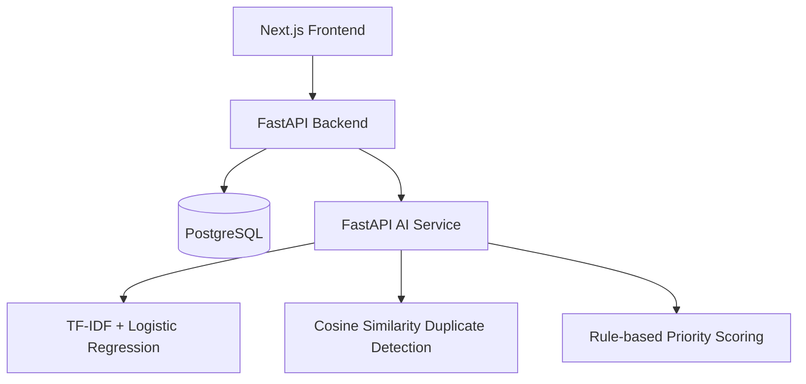

# SmartTriage System Architecture

## 1. Tổng Quan Hệ Thống

SmartTriage là hệ thống tiếp nhận, phân loại và ưu tiên phản ánh sinh viên bằng Machine Learning. Hệ thống hỗ trợ ba nhóm người dùng chính:

- Sinh viên tạo phản ánh và theo dõi trạng thái xử lý.
- Nhân viên xử lý ticket theo phòng ban được gợi ý.
- Admin theo dõi dashboard, quản lý ticket và điều phối quy trình.

Mục tiêu của SmartTriage không chỉ là CRUD ticket. Điểm chính của hệ thống là kết hợp workflow phản ánh với AI service để phân loại nội dung, tính mức độ ưu tiên, phát hiện phản ánh tương tự và gợi ý phòng ban xử lý.

## 2. Lý Do Tách Backend Service Và AI Service

SmartTriage tách backend nghiệp vụ và AI service vì hai phần này có nhịp phát triển khác nhau:

- Backend chịu trách nhiệm authentication, authorization, database, ticket workflow, dashboard và API cho frontend.
- AI service chịu trách nhiệm ML inference, text preprocessing, classifier, duplicate detection, priority scoring và recommender.
- Backend giao tiếp với AI service qua HTTP, không import trực tiếp code ML. Điều này giúp thay model hoặc thuật toán mà không làm thay đổi nghiệp vụ chính.
- AI service có thể scale độc lập khi inference nặng hơn hoặc cần tài nguyên riêng.
- Khi AI service lỗi hoặc tắt, backend vẫn tạo ticket và log lỗi, giúp workflow nghiệp vụ không bị dừng hoàn toàn.

## 3. Kiến Trúc Tổng Thể

Các service chính:

| Service | Công nghệ | Vai trò | Port |
| --- | --- | --- | --- |
| Frontend | Next.js, TypeScript, Tailwind CSS | Giao diện login, ticket, dashboard, admin management | 3000 |
| Backend | FastAPI, SQLAlchemy, Alembic | API nghiệp vụ, auth, ticket workflow, dashboard | 8000 |
| AI Service | FastAPI, scikit-learn, pandas, joblib | ML inference, duplicate detection, recommender | 8001 |
| PostgreSQL | PostgreSQL 16 | Lưu users, tickets, ticket analyses | 5432 |

## 4. Luồng Tạo Ticket Và Phân Tích AI

Luồng chính khi sinh viên tạo phản ánh:

1. Frontend gửi `POST /api/v1/tickets` đến backend với `title` và `description`.
2. Backend xác thực JWT, tạo ticket với trạng thái `analyzing`.
3. Backend query tối đa 100 ticket đang `open` hoặc `in_progress` để làm context duplicate detection.
4. Backend gọi AI service qua `POST /api/v1/analyze-ticket`.
5. AI service xử lý:
   - Chuẩn hóa văn bản.
   - Dự đoán category bằng TF-IDF + Logistic Regression.
   - Tính priority score bằng rule-based scoring.
   - Tìm ticket tương tự bằng TF-IDF + cosine similarity.
   - Gợi ý phòng ban và hành động xử lý.
6. Backend lưu kết quả vào `ticket_analyses`.
7. Backend cập nhật `assigned_department` theo AI service và chuyển ticket sang `open`.
8. Frontend hiển thị ticket detail kèm AI analysis.

Nếu AI service không phản hồi, backend vẫn lưu ticket và chuyển trạng thái sang `open`, nhưng `analysis` có thể rỗng.

## 5. Database Schema

Các bảng cốt lõi:

### `users`

| Cột | Ý nghĩa |
| --- | --- |
| `id` | UUID user |
| `full_name` | Họ tên |
| `email` | Email đăng nhập, unique |
| `hashed_password` | Mật khẩu đã hash |
| `role` | `student`, `staff`, `admin` |
| `department` | Phòng ban của staff |
| `is_active` | Trạng thái tài khoản |
| `created_at`, `updated_at` | Thời gian tạo và cập nhật |

### `tickets`

| Cột | Ý nghĩa |
| --- | --- |
| `id` | UUID ticket |
| `title`, `description` | Nội dung phản ánh |
| `status` | `new`, `analyzing`, `open`, `in_progress`, `resolved`, `rejected` |
| `created_by_id` | Người tạo ticket |
| `assigned_department` | Phòng ban được gán |
| `assigned_to_id` | Nhân viên phụ trách nếu có |
| `manual_category`, `manual_priority` | Ghi đè thủ công bởi staff/admin |
| `created_at`, `updated_at`, `resolved_at` | Mốc thời gian xử lý |

### `ticket_analyses`

| Cột | Ý nghĩa |
| --- | --- |
| `id` | UUID analysis |
| `ticket_id` | Ticket được phân tích |
| `predicted_category`, `category_label` | Category AI dự đoán |
| `category_confidence` | Độ tin cậy classifier |
| `priority`, `priority_score` | Mức ưu tiên và điểm 0-100 |
| `suggested_department` | Phòng ban gợi ý |
| `duplicate_candidates` | Danh sách ticket tương tự dạng JSON |
| `suggested_actions` | Gợi ý xử lý ban đầu dạng JSON |
| `model_version` | Version model |
| `created_at` | Thời gian phân tích |

## 6. API Chính

Backend API:

- `POST /api/v1/auth/register`
- `POST /api/v1/auth/login`
- `GET /api/v1/auth/me`
- `POST /api/v1/tickets`
- `GET /api/v1/tickets`
- `GET /api/v1/tickets/{ticket_id}`
- `PATCH /api/v1/tickets/{ticket_id}/status`
- `PATCH /api/v1/tickets/{ticket_id}`
- `GET /api/v1/dashboard/stats`
- `GET /api/v1/dashboard/tickets-by-category`
- `GET /api/v1/dashboard/tickets-by-priority`
- `GET /api/v1/dashboard/tickets-by-status`
- `GET /api/v1/dashboard/recent-tickets`

AI service API:

- `GET /api/v1/health`
- `POST /api/v1/analyze-ticket`
- `GET /api/v1/model-info`

## 7. ML Pipeline

Pipeline AI service gồm:

1. Text preprocessing: lowercase, remove URL/email, remove punctuation dư thừa, normalize spaces.
2. Category classification: TF-IDF vectorizer + Logistic Regression.
3. Priority scoring: rule-based scoring theo category weight, urgent keywords, deadline signal và affected scope.
4. Duplicate detection: TF-IDF vectorization + cosine similarity trên ticket mới và ticket đang mở.
5. Department recommendation: mapping theo category.
6. Action recommendation: template gợi ý xử lý theo category và priority.

## 8. Khả Năng Mở Rộng

Hệ thống có thể mở rộng theo nhiều hướng:

- Thêm message queue để backend không phải chờ AI inference đồng bộ.
- Chạy AI service nhiều replica nếu số lượng ticket tăng.
- Thêm model feedback loop để admin sửa category/priority và dữ liệu đó quay lại training.
- Thêm notification realtime cho staff khi có ticket high priority.
- Tách dashboard aggregation thành cache hoặc materialized view khi dữ liệu lớn.
- Bổ sung observability gồm logs tập trung, tracing và metrics.

## 9. Rủi Ro Và Hướng Cải Thiện

| Rủi ro | Ảnh hưởng | Hướng cải thiện |
| --- | --- | --- |
| Dataset demo còn nhỏ | Model có thể đạt metric cao nhưng chưa phản ánh dữ liệu thật | Thu thập thêm phản ánh thật đã ẩn danh |
| Rule priority còn thủ công | Một số case edge có thể bị đánh giá chưa chuẩn | Kết hợp feedback từ staff và học trọng số |
| AI service đồng bộ | Ticket create có thể chậm nếu AI service bận | Chuyển sang async job hoặc queue |
| Duplicate detection dùng TF-IDF | Chưa hiểu ngữ nghĩa sâu | Thử sentence embedding khi có dữ liệu đủ |
| Chưa có CI/CD đầy đủ | Dễ bỏ sót regression khi merge | Thêm GitHub Actions cho lint, test, build |
